# QuizFlow Diagrams

These diagrams visualize the product and technical contracts defined in the other documents. Names are conceptual and may differ slightly from final Prisma model names, but their relationships and lifecycle rules must remain intact.

## System context

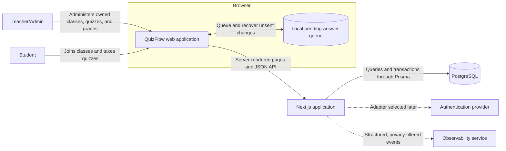

Dashed dependencies are intentionally vendor-neutral until the relevant provider is selected.

## Application boundaries

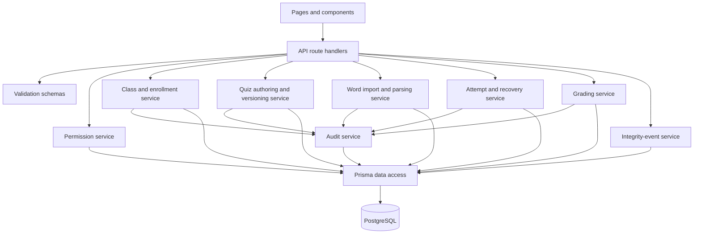

Route handlers authenticate, validate, authorize, call a domain service, and serialize an explicit response. Business rules do not live in React components or route handlers.

## Login and forgot-password sequence

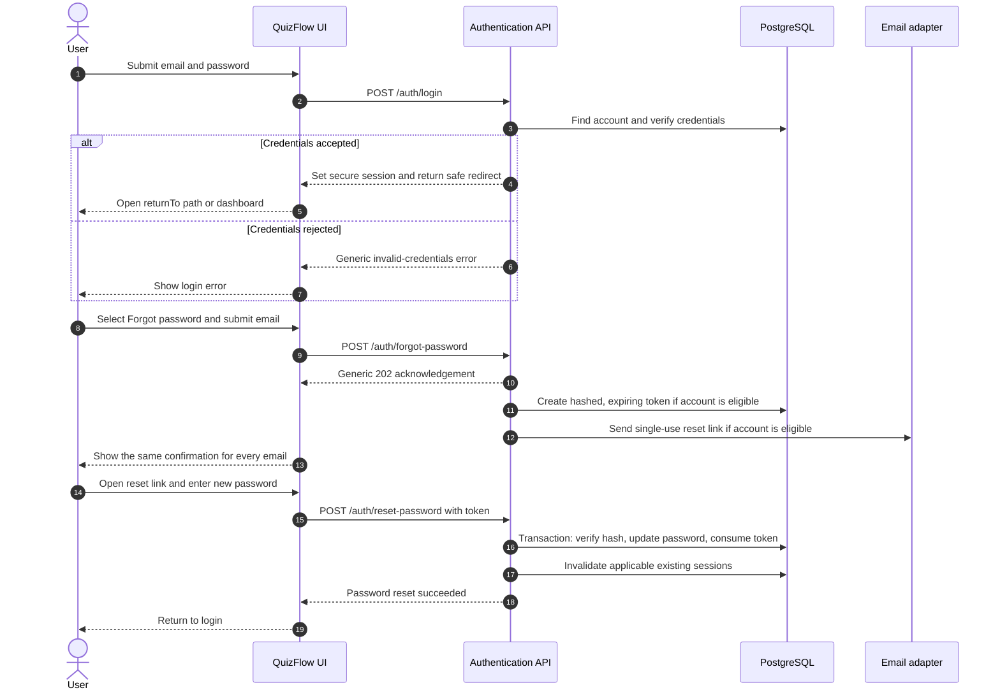

The forgot-password response does not wait on or reveal email delivery. Invalid, expired, and used reset links cannot change a password and lead to a clear request-another-link state.

## Core data model

```mermaid
erDiagram
    USER ||--o| TEACHER_ADMIN_PROFILE : has
    USER ||--o| STUDENT_PROFILE : has
    USER ||--o{ PASSWORD_RESET_TOKEN : requests
    USER ||--o{ CLASS : owns
    USER ||--o{ ENROLLMENT : receives
    CLASS ||--o{ ENROLLMENT : contains
    CLASS ||--o{ REGISTRATION_INVITE : issues
    CLASS ||--o{ QUIZ : contains
    QUIZ ||--o{ QUIZ_IMPORT : receives
    QUIZ ||--o{ QUIZ_VERSION : publishes
    QUIZ_VERSION ||--|{ QUESTION_SNAPSHOT : contains
    QUESTION_SNAPSHOT ||--o{ OPTION_SNAPSHOT : offers
    ENROLLMENT ||--o{ ATTEMPT : authorizes
    QUIZ_VERSION ||--o{ ATTEMPT : instantiates
    ATTEMPT ||--o{ RESPONSE : contains
    QUESTION_SNAPSHOT ||--o{ RESPONSE : answers
    ATTEMPT ||--o{ INTEGRITY_EVENT : records
    RESPONSE ||--o{ GRADE_REVISION : audits
    CLASS ||--o{ AUDIT_EVENT : records

    USER {
        string id PK
        string email UK
        string displayName
        enum role
        enum themePreference
    }

    PASSWORD_RESET_TOKEN {
        string id PK
        string userId FK
        string tokenHash UK
        datetime expiresAt
        datetime usedAt
        datetime createdAt
    }

    CLASS {
        string id PK
        string teacherAdminId FK
        string name
        string subject
        enum academicLevel
        string schoolYear
        string term
        enum status
    }

    ENROLLMENT {
        string id PK
        string classId FK
        string studentId FK
        enum status
        enum source
        datetime enrolledAt
    }

    REGISTRATION_INVITE {
        string id PK
        string classId FK
        string tokenHash UK
        datetime expiresAt
        int maxUses
        int useCount
        datetime revokedAt
    }

    QUIZ {
        string id PK
        string classId FK
        string title
        enum status
        json draftSettings
    }

    QUIZ_IMPORT {
        string id PK
        string quizId FK
        string originalFileName
        string checksumSha256
        enum status
        json proposals
        json issues
        datetime createdAt
        datetime appliedAt
    }

    QUIZ_VERSION {
        string id PK
        string quizId FK
        int versionNumber
        json settingsSnapshot
        decimal totalPoints
        datetime publishedAt
    }

    QUESTION_SNAPSHOT {
        string id PK
        string quizVersionId FK
        enum type
        string prompt
        decimal points
        int position
        json gradingRule
    }

    OPTION_SNAPSHOT {
        string id PK
        string questionSnapshotId FK
        string label
        boolean isCorrect
        int position
    }

    ATTEMPT {
        string id PK
        string enrollmentId FK
        string quizVersionId FK
        int attemptNumber
        enum status
        int version
        datetime startedAt
        datetime deadlineAt
        datetime submittedAt
        decimal earnedPoints
    }

    RESPONSE {
        string id PK
        string attemptId FK
        string questionSnapshotId FK
        json answerValue
        enum gradingState
        decimal earnedPoints
        datetime updatedAt
    }

    INTEGRITY_EVENT {
        string id PK
        string attemptId FK
        string clientEventId
        enum type
        enum severity
        datetime occurredAt
        datetime receivedAt
        json metadata
    }

    GRADE_REVISION {
        string id PK
        string responseId FK
        string teacherAdminId FK
        decimal previousPoints
        decimal newPoints
        string reason
        datetime createdAt
    }

    AUDIT_EVENT {
        string id PK
        string classId FK
        string actorId FK
        string action
        string targetType
        string targetId
        datetime createdAt
    }
```

Recommended uniqueness rules:

- `USER.normalizedEmail` is unique.
- `PASSWORD_RESET_TOKEN.tokenHash` is unique and raw tokens are never stored.
- `(ENROLLMENT.classId, ENROLLMENT.studentId)` is unique.
- `REGISTRATION_INVITE.tokenHash` is unique.
- `(QUIZ_VERSION.quizId, QUIZ_VERSION.versionNumber)` is unique.
- `(ATTEMPT.enrollmentId, ATTEMPT.quizVersionId, ATTEMPT.attemptNumber)` is unique.
- `(RESPONSE.attemptId, RESPONSE.questionSnapshotId)` is unique.
- `(INTEGRITY_EVENT.attemptId, INTEGRITY_EVENT.clientEventId)` is unique.

## Class registration sequence

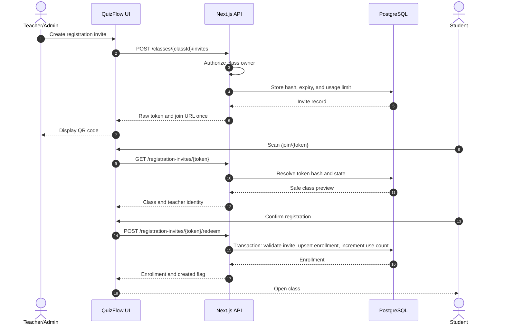

The redemption transaction locks or atomically updates the invite so concurrent scans cannot exceed its usage limit.

## Word-to-quiz import sequence

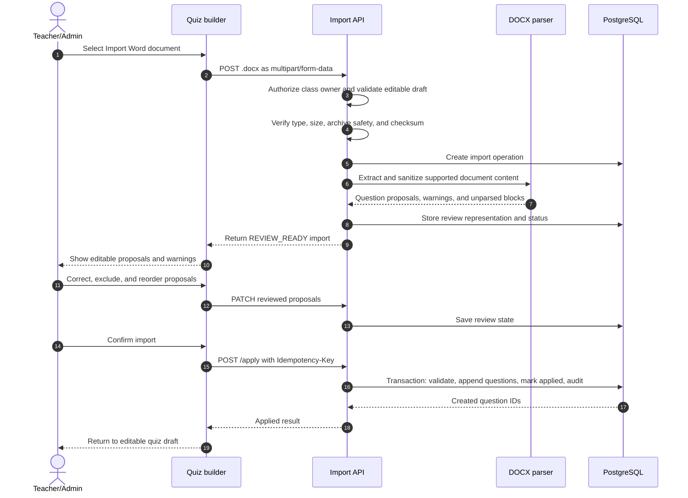

Upload and parsing never publish the quiz. Repeating the same apply request returns the original result and does not duplicate questions.

## Quiz publication and attempt snapshot

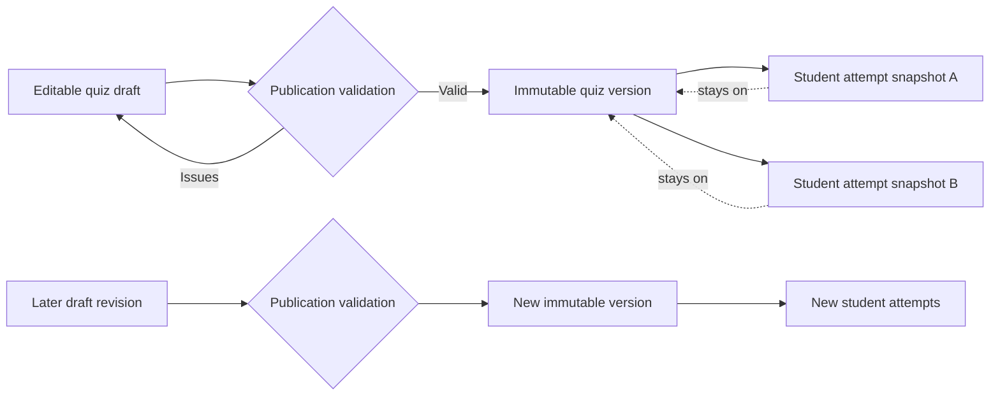

Publishing a later version does not mutate attempts already tied to an earlier version.

## Student attempt and autosave sequence

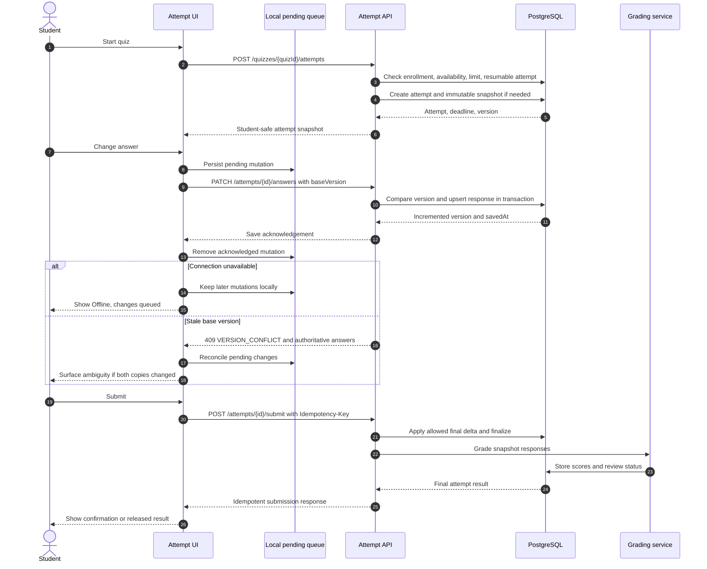

## Attempt state machine

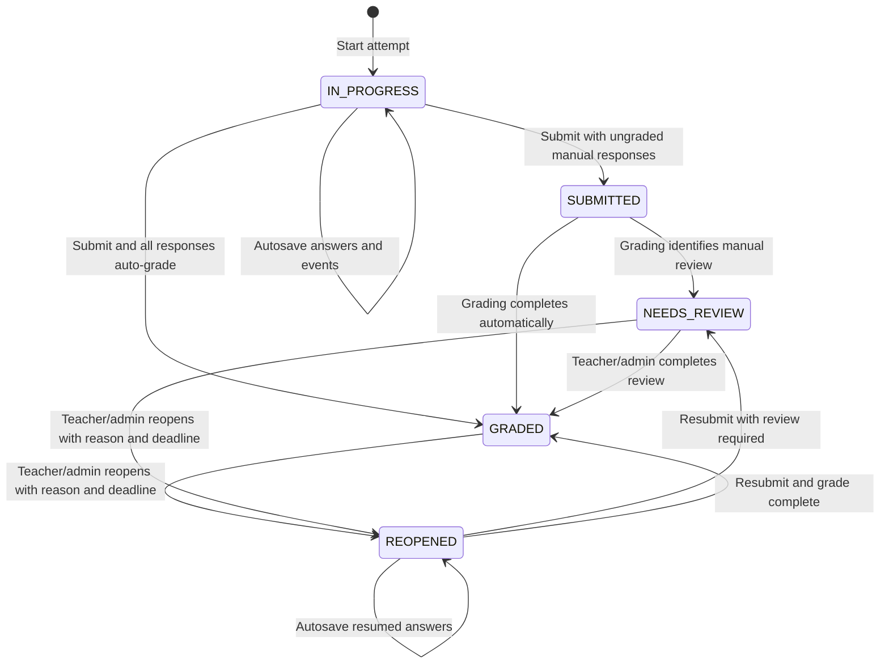

`SUBMITTED` may be short-lived during synchronous grading or longer-lived if grading is moved to a background job. Student result visibility is a separate release policy, not an attempt lifecycle state.

## Deadline calculation

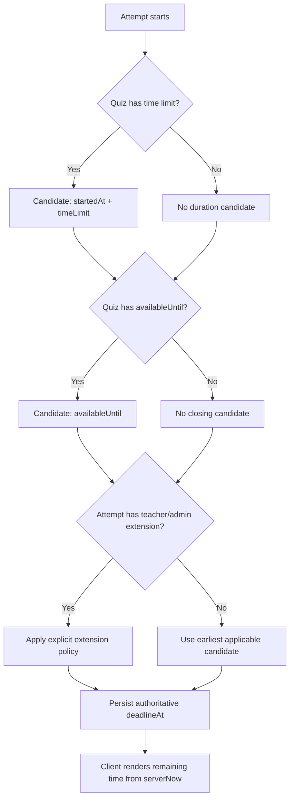

The server persists the authoritative `deadlineAt` on the attempt. The client timer is presentational and periodically corrects itself from server time.

## Integrity-event pipeline

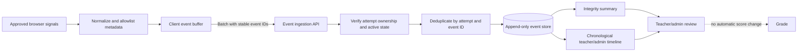

The event pipeline excludes clipboard contents, keystrokes, screenshots, audio, video, and unrelated browsing data.

## Theme resolution

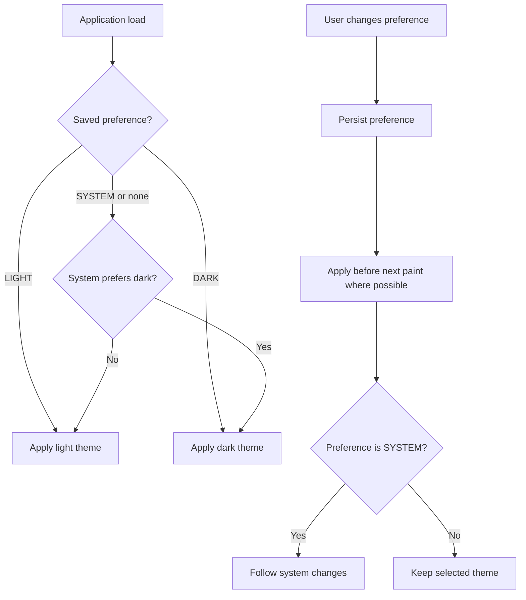

## Authorization decision path

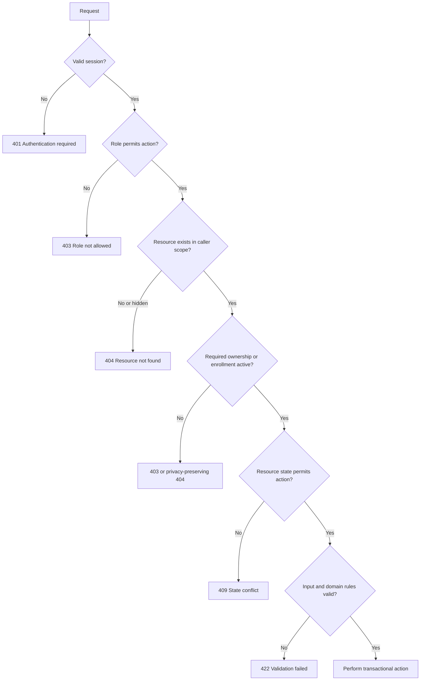

## Documentation relationships

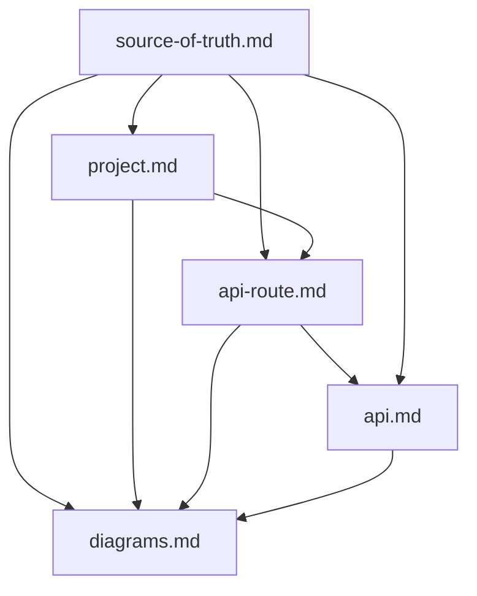

When a diagram conflicts with a written contract, update the diagram to match the higher-precedence document rather than treating the diagram as a separate decision source.
